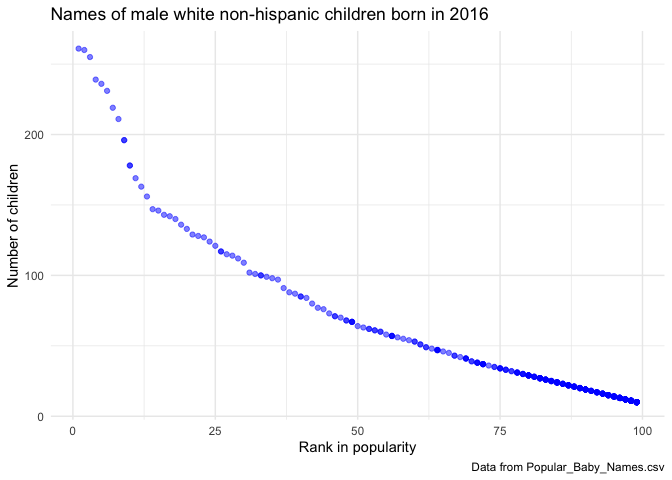

p8105\_hw2\_rz2570
================
Ruilian Zhang
10/2/2021

``` r
library(tidyverse)
```

    ## ── Attaching packages ─────────────────────────────────────── tidyverse 1.3.1 ──

    ## ✓ ggplot2 3.3.5     ✓ purrr   0.3.4
    ## ✓ tibble  3.1.4     ✓ dplyr   1.0.7
    ## ✓ tidyr   1.1.3     ✓ stringr 1.4.0
    ## ✓ readr   2.0.1     ✓ forcats 0.5.1

    ## ── Conflicts ────────────────────────────────────────── tidyverse_conflicts() ──
    ## x dplyr::filter() masks stats::filter()
    ## x dplyr::lag()    masks stats::lag()

``` r
library(readxl)
```

# Problem 1

``` r
# read and clean Mr. Trash Wheel data
trash_wheel_df = read_excel("data/Trash-Wheel-Collection-Totals-7-2020-2.xlsx", sheet = "Mr. Trash Wheel", range = "A2:N535") %>% 
  janitor::clean_names() %>% 
  select(-starts_with("x")) %>% 
  drop_na(dumpster) %>% 
  mutate(sports_balls = round(sports_balls))
```

``` r
# read and clean precipitation data for 2018 and 2019
precipitation_2018 = read_excel("data/Trash-Wheel-Collection-Totals-7-2020-2.xlsx", sheet = "2018 Precipitation", range = "A2:B14") %>% 
  janitor::clean_names() %>%
  drop_na() %>% 
  rename(total_precipitation = total) %>% 
  mutate(year = 2018) %>% 
  relocate(year)

precipitation_2019 = read_excel("data/Trash-Wheel-Collection-Totals-7-2020-2.xlsx", sheet = "2019 Precipitation", range = "A2:B14") %>% 
  janitor::clean_names() %>%
  drop_na() %>% 
  rename(total_precipitation = total) %>% 
  mutate(year = 2019) %>% 
  relocate(year)

# combine precipitation datasets and convert month to a character variable
precipitation_df = bind_rows(precipitation_2018, precipitation_2019) %>% 
  mutate(month = month.name[month])
```

-   In trash\_wheel\_df, there are 454 observations. In
    precipitation\_df, there are 24 observations.
-   For example, in trash\_wheel\_df, the rounded number of sports balls
    in dumpster 1 is 7 and the number of cigarette butts is 126000 in
    May 2014. In precipitation\_df, the total precipitation in June 2018
    is 4.77 inch, and in June 2019 is 0.42 inch.
-   For available data, the total precipitation in 2018 is 70.33. The
    median number of sports balls in a dumpster in 2019 is 9.

# Problem 2

``` r
# clean the data in pols-month.csv
pols_df = read_csv("data/fivethirtyeight_datasets/pols-month.csv") %>%
  separate(col = mon, into = c("year", "month", "day"), sep = "-") %>%
  mutate(year = as.numeric(year)) %>% 
  mutate(month = as.numeric(month)) %>% 
  mutate(month = month.name[month]) %>% 
  mutate(president = ifelse(prez_gop == "1", "gop", "dem")) %>% 
  select(-c(prez_dem, prez_gop)) %>% 
  select(-day)
```

    ## Rows: 822 Columns: 9

    ## ── Column specification ────────────────────────────────────────────────────────
    ## Delimiter: ","
    ## dbl  (8): prez_gop, gov_gop, sen_gop, rep_gop, prez_dem, gov_dem, sen_dem, r...
    ## date (1): mon

    ## 
    ## ℹ Use `spec()` to retrieve the full column specification for this data.
    ## ℹ Specify the column types or set `show_col_types = FALSE` to quiet this message.

``` r
# clean the data in snp.csv
snp_df = read_csv("data/fivethirtyeight_datasets/snp.csv") %>% 
  separate(col = date, into = c("month", "day", "year"),sep = "/") %>% 
  select(-day) %>% 
  mutate(year = as.numeric(year)) %>% 
  mutate(year = ifelse(year < 50, year + 2000, year + 1900)) %>% 
  mutate(month = as.numeric(month)) %>%
  arrange(year, month) %>% 
  mutate(month = month.name[month]) %>% 
  relocate(year, month)
```

    ## Rows: 787 Columns: 2

    ## ── Column specification ────────────────────────────────────────────────────────
    ## Delimiter: ","
    ## chr (1): date
    ## dbl (1): close

    ## 
    ## ℹ Use `spec()` to retrieve the full column specification for this data.
    ## ℹ Specify the column types or set `show_col_types = FALSE` to quiet this message.

``` r
# clean the data in unemployment.csv
unemployment_df = read_csv("data/fivethirtyeight_datasets/unemployment.csv") %>% 
  janitor::clean_names() %>% 
  pivot_longer(
    cols = jan:dec,
    names_to = "month",
    values_to = "percentage"
  )
```

    ## Rows: 68 Columns: 13

    ## ── Column specification ────────────────────────────────────────────────────────
    ## Delimiter: ","
    ## dbl (13): Year, Jan, Feb, Mar, Apr, May, Jun, Jul, Aug, Sep, Oct, Nov, Dec

    ## 
    ## ℹ Use `spec()` to retrieve the full column specification for this data.
    ## ℹ Specify the column types or set `show_col_types = FALSE` to quiet this message.

``` r
# join the datasets by merging snp into pols
pols_merge = left_join(pols_df, snp_df)
```

    ## Joining, by = c("year", "month")

``` r
# merge unemployment into the result and rename the variables
pols_merge = mutate(pols_merge, month = str_to_lower(month)) %>% 
  mutate(month = substr(month, 1, 3))

pols_result = left_join(pols_merge, unemployment_df) %>% 
  rename(
    president_party = president,
    close_stock_index = close,
    unemployment_percentage = percentage
  )
```

    ## Joining, by = c("year", "month")

``` r
# have a look at the resulting dataset
skimr::skim(pols_result)
```

-   Dataset **pols\_df** contains 822 observations of 9 variables
    related to the number of national politicians who are democratic or
    republican at any given time. The **snp\_df** contains 787
    observations of 3 variables, which are the date of observation and
    the closing values of the S&P stock index on the associated date.
    The **unemployment\_df** contains 816 observations of 3 variables,
    which are the date of observation and the percentage of unemployment
    on the associated date.
-   The resulting **dataset pol\_result** has 822 rows and 11 columns,
    containing all the variables from above datasets. The range of year
    lists from 1947 to 2015. Some key variables are *president\_party*
    (whether the president was democratic or republican),
    *close\_stock\_index* (the closing values of the S&P stock index)
    and *unemployment\_percentage* (the percentage of unemployment).

# Problem 3

``` r
# import and clean Popular_Baby_Names.csv
names_df = read_csv("data/Popular_Baby_Names.csv", col_types = "dffcdd") %>% 
  janitor::clean_names() %>% 
  mutate(childs_first_name = str_to_upper(childs_first_name))

# look at the variable of naming inconsistency and recode
levels(names_df$ethnicity)
```

    ## [1] "ASIAN AND PACIFIC ISLANDER" "BLACK NON HISPANIC"        
    ## [3] "HISPANIC"                   "WHITE NON HISPANIC"        
    ## [5] "ASIAN AND PACI"             "BLACK NON HISP"            
    ## [7] "WHITE NON HISP"

``` r
names_df = mutate(
  names_df,
  ethnicity = recode(ethnicity,
                     "ASIAN AND PACI" = "ASIAN AND PACIFIC ISLANDER",
                     "BLACK NON HISP" = "BLACK NON HISPANIC",
                     "WHITE NON HISP" = "WHITE NON HISPANIC"))

# remove duplicated rows
names_df = distinct(names_df)
```

``` r
# produce a table showing the rank in popularity of the name “Olivia” as a female baby over time

olivia_df = filter(
  names_df,
  gender == "FEMALE",
  childs_first_name == "OLIVIA"
  ) %>% 
  select(-c(childs_first_name, gender, count)) %>% 
  arrange(year_of_birth)
  
olivia_table = pivot_wider(
  olivia_df,
  names_from = "year_of_birth",
  values_from = "rank"
)
```

``` r
# produce a similar table showing the most popular name among male children over time
male_name_df = filter(names_df, gender == "MALE", rank == "1") %>% 
  select(-c(gender, count, rank)) %>% 
  arrange(year_of_birth)

male_name_table = pivot_wider(
  male_name_df,
  names_from = "year_of_birth",
  values_from = "childs_first_name"
)
```

``` r
# produce a scatter plot for male, white non-hispanic children born in 2016

plot_data = filter(
  names_df,
  gender == "MALE",
  ethnicity == "WHITE NON HISPANIC",
  year_of_birth == "2016"
)

ggplot(plot_data, aes(x = rank, y = count)) + 
  geom_point(alpha = .5, color = "blue") + 
  theme_minimal() +
  labs(
    title = "Names of male white non-hispanic children born in 2016",
    x = "Rank in popularity",
    y = "Number of children",
    caption = "Data from Popular_Baby_Names.csv")
```

<!-- -->
